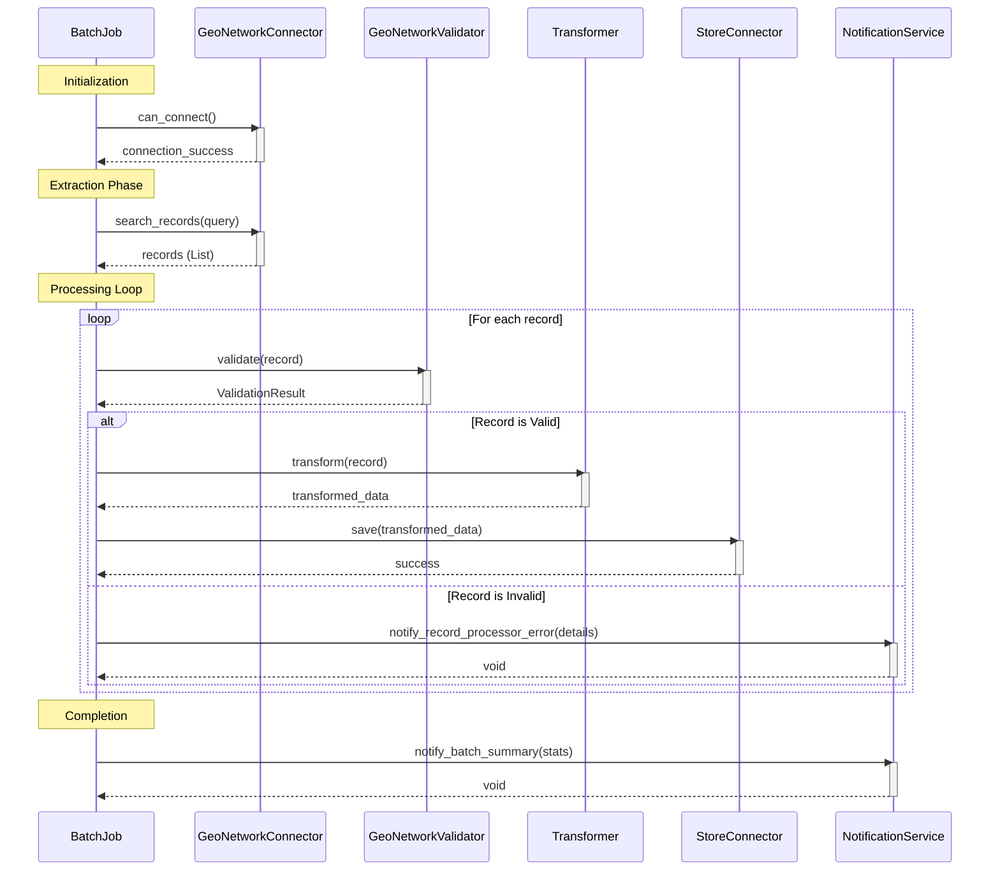

# ETL Pipeline Sequence Diagram

This diagram illustrates the high-level control flow of the ETL pipeline, orchestrated by `BatchJob`.

It includes:
- **Extraction**: Fetching records from `GeoNetworkConnector`.
- **Validation**: Validating records using `GeoNetworkValidator`.
- **Transformation**: Processing valid records using `Transformer` (Placeholder).
- **Loading**: Saving processed records using `StoreConnector` (Placeholder).
- **Notification**: Sending alerts and summaries via `NotificationService`.

